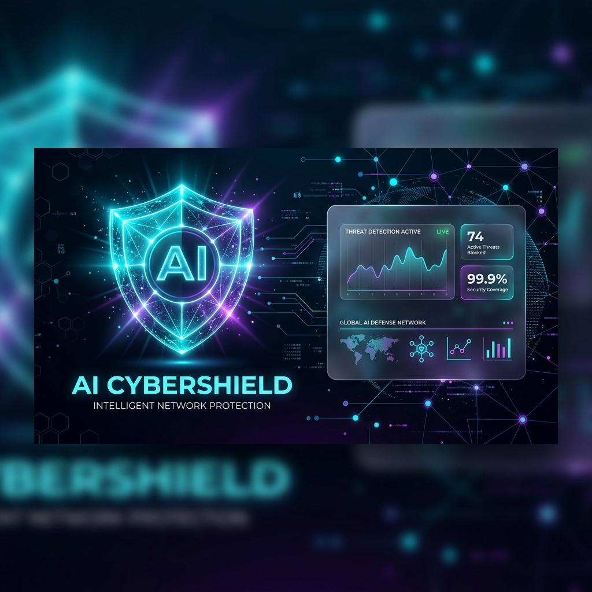
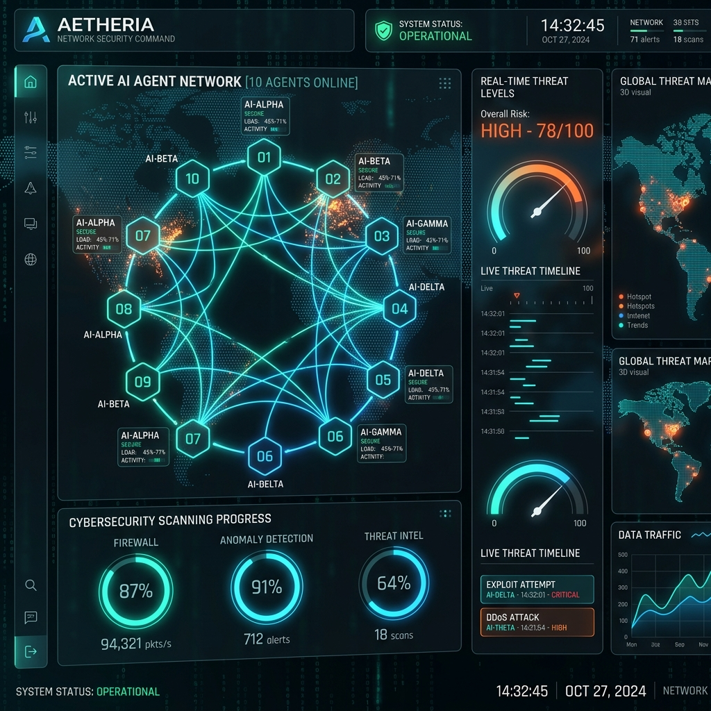

<p align="center">
  
</p>

# AI CyberShield — AI-Powered Cybersecurity & Fraud Protection Ecosystem

> **Detect • Verify • Prevent • Protect**

AI CyberShield is a digital trust operating system designed to safeguard individuals, families, businesses, and enterprises from modern cybersecurity threats. It features **10 coordinate AI Agent systems** orchestrated to scan links, verify files for deepfakes, assess transaction signals for fraud in real-time, and check chat dialogs for coercion triggers.

---

## 🚀 Getting Started

AI CyberShield runs natively on standard systems without Docker wrappers.

### Prerequisites
- **Node.js** (v18.0+)
- **Python** (v3.12+)
- **npm** (v9.0+)

---

### 1. Backend Service (FastAPI)

The backend hosts the API gateway, sqlite databases, Random Forest/Isolation Forest transaction classifiers, and the Multi-Agent orchestrator cluster.

```bash
# Navigate to the backend folder
cd backend

# Install dependencies (FastAPI, SQLAlchemy, scikit-learn, etc.)
pip install -r requirements.txt

# Start the uvicorn development server
python main.py
```
*The backend API will start running on **`http://127.0.0.1:8000`** with interactive Swagger documentation available at `/docs`.*

---

### 2. Frontend Dashboard (Vite + React)

A premium single-page dashboard styled with deep-space dark themes and custom glassmorphic panel elements.

```bash
# Navigate to the frontend folder
cd frontend

# Install dependencies
npm install

# Run the local development server
npm run dev
```
*The React application will launch locally on **`http://localhost:3000`**.*

---

## 🛠️ System Architecture & Codebase

```
AI_CyberShield/
│
├── architecture/                     # System Blueprints & Specifications
│   ├── product_architecture.md       # SaaS tiers, roadmap, and Nginx scaling rules
│   ├── database_schema.md            # PostgreSQL, MongoDB, and Vector DB schemas
│   ├── api_design.md                 # REST API endpoints & WebSocket designs
│   └── ai_agents.md                  # Workflow protocols for the 10-Agent cluster
│
├── backend/                          # FastAPI Backend Engine
│   ├── routers/                      # Individual API Routers
│   │   ├── auth.py                   # User signup, bcrypt, and JWT profiles
│   │   ├── threat_engine.py          # Scanners for links, deepfakes, and chats
│   │   ├── fraud_engine.py           # UPI transaction scorers
│   │   └── device_security.py        # Micro-telemetry & mic/camera auditors
│   ├── main.py                       # App initialization & DB bootstrap
│   ├── database.py                   # SQLite SQLalchemy connection definitions
│   ├── models.py                     # Database schemas
│   ├── schemas.py                    # Input validation templates (Pydantic)
│   ├── ml_models.py                  # Random Forest & Isolation Forest scoring engines
│   ├── agent_orchestrator.py         # 10-Agent coordinator & memory router
│   ├── requirements.txt              # Backend packages
│   └── test_api.py                   # Diagnostic API suite tests
│
└── frontend/                         # Vite + React Frontend Dashboard
    ├── src/
    │   ├── components/
    │   │   ├── Sidebar.jsx           # Sidebar menu navigation
    │   │   ├── AgentVisualizer.jsx   # Live state chart for 10-Agent clusters
    │   │   └── SecurityAssistant.jsx # Interactive AI chat & terminal step logger
    │   ├── views/                    # Views representing all 10 security modules
    │   │   ├── Dashboard.jsx         # Core metrics and unresolved alerts dashboard
    │   │   ├── FraudEngine.jsx       # Transaction anomaly validator
    │   │   ├── WebsiteChecker.jsx    # Phishing typosquatting verifier
    │   │   ├── WhatsAppDetector.jsx   # Conversation red-flags scanner
    │   │   ├── DeepfakeDetector.jsx  # Media visual & audio spectral analyzer
    │   │   ├── CallProtection.jsx    # Voice-clone intercept toggles
    │   │   ├── EmailSecurity.jsx     # Header verification and quarantine logs
    │   │   ├── IdentityMonitor.jsx   # Darknet leak exposure audit scanner
    │   │   ├── SocialProtection.jsx  # Impersonation handle visualizer
    │   │   └── DeviceSecurity.jsx    # Camera/Mic indicator logs
    │   ├── App.jsx                   # Central routing & alerts coordinator
    │   ├── main.jsx                  # React bootstrap entrypoint
    │   └── index.css                 # Custom glassmorphism variables & dark CSS theme
    ├── package.json                  # Frontend packages
    └── vite.config.js                # Vite plugins config
```

---

## 🤖 The 10-Agent Security Cluster

<p align="center">
  
</p>

AI CyberShield delegates scan operations to coordinate agents using semantic routing rules:
1. **Threat Intelligence**: Checks global reputation indexes and searches credential exposures in vector lists.
2. **Fraud Investigator**: Evaluates UPI transfers for behavior indicators (AnyDesk overlays, urgency).
3. **Deepfake Analyzer**: Inspects video frames and audio harmonics for synthetic render vectors.
4. **Website Inspector**: Scans domain registration WHOIS details, SSL paths, and logo similarity.
5. **Scam Conversation Analyzer**: Identifies manipulation tactics and coercion markers.
6. **Recovery Assistant**: Formulates regulatory claim forms and bank dispute letters.
7. **Incident Response**: Coordinates logs, creates audit trails, and isolates compromised links.
8. **Security Advisor**: Audits user configuration profiles against Zero-Trust standards.
9. **Device Protection**: Audits camera/microphone activity logs.
10. **Personal Security**: Interfaces user prompts and acts as the coordinating chat agent.

---

## 🧪 Verification & Testing

<p align="center">
  
</p>

Verify backend logic and scoring models using the test script:
```bash
# Execute unit tests
python backend/test_api.py
```
*All 7 tests for health check, banking scoring, phishing scanners, and chat analyzers compile with **`OK`** verification.*
