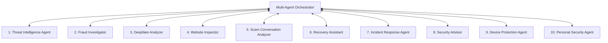

# AI CyberShield — Multi-Agent AI System

AI CyberShield uses a hierarchical multi-agent orchestration architecture. A central Coordinator (the Multi-Agent Orchestrator) routes requests, handles session memory state, and streams operational transcripts back to the client interface.

---

## 1. The 10 Specialized Agents



### Agent 1: Threat Intelligence Agent
- **Objective**: Aggregates global feeds, registers IP reputations, searches leak vectors, and queries the Vector DB for known phishing footprints.
- **Tools**: Vector DB Search, DNS Resolver, IP Blacklist Lookup, DarkWeb Leak DB Query.

### Agent 2: Fraud Investigator
- **Objective**: Evaluates transactions, monitors behavioral parameters (AnyDesk/TeamViewer active, calls active, urgency triggers), and constructs the Fraud Timeline.
- **Tools**: ML Scoring Engine, Behavior Metric Evaluator, Transaction Log search.

### Agent 3: Deepfake Analyzer
- **Objective**: Runs frequency analyzer heuristics on audio inputs, evaluates image structures for edge mismatches, and determines lip-sync deviations.
- **Tools**: Synthetic Audio Spectral Classifier, CNN Face Artifact Verifier, Video Metadata Parser.

### Agent 4: Website Inspector
- **Objective**: Inspects URL structure, certificates, domain ages, redirects, and visually compares brand logos.
- **Tools**: WHOIS Extractor, SSL Certificate Validator, Logo Similarity embedding generator.

### Agent 5: Scam Conversation Analyzer
- **Objective**: Inspects chat inputs for manipulative scripts, coercion language, OTP demands, and money transfer traps.
- **Tools**: Sentiment Analyzer, Coercion Dictionary Matcher, Scam Pattern classifier.

### Agent 6: Recovery Assistant
- **Objective**: Formulates custom recovery guides, templates bank dispute emails, and details cybersecurity claims guidelines.
- **Tools**: Document Template Compiler, Legal/Regulatory DB Query.

### Agent 7: Incident Response Agent
- **Objective**: Generates tickets, isolates target accounts, changes API permissions, and reports phishing sites.
- **Tools**: SQLite/Postgre Alert Logger, SendAlert SMS/Email Hook, Abuse.ch Reporter.

### Agent 8: Security Advisor
- **Objective**: Evaluates user configuration settings, recommends changes, and runs mock phishing assessments.
- **Tools**: Configuration Auditor, Training Simulator.

### Agent 9: Device Protection Agent
- **Objective**: Collects device health statistics, checks camera/microphone usage, and rates running background processes.
- **Tools**: System Activity Monitor, Permission Auditor.

### Agent 10: Personal Security Agent
- **Objective**: Operates the primary user chat assistant, aggregates individual dashboard results, and triggers security updates.
- **Tools**: Session Memory Manager, Prompt Router.

---

## 2. Multi-Agent Orchestrator Workflows

### Example 1: Phishing Verification Flow
When a user inputs a URL to inspect:
```
  [User URL Input] ──> [Orchestrator]
                            │
                            ├─> [Website Inspector]
                            │   (Queries WHOIS, checks SSL validity, scans logo tags)
                            │
                            ├─> [Threat Intelligence Agent]
                            │   (Checks blacklists & matches patterns in Vector DB)
                            │
                            ▼
                     [Orchestrator compiles verdicts] ──> [Incident Response Agent]
                                                              (Logs Alert if dangerous)
```

### Example 2: Interactive Transaction Investigation
During a suspicious bank transfer:
```
  [UPI Transaction Started] ──> [Fraud Investigator]
                                     │
                    (Identifies active call + screen share)
                                     │
                                     ▼
                          [Orchestrator alerts]
                                     │
                    ┌────────────────┴────────────────┐
                    ▼                                 ▼
         [Threat Intelligence]              [Incident Response]
  (Checks target UPI handle reputation)     (Blocks transfer and opens incident)
```

---

## 3. Communication Protocol

Agents communicate via JSON payloads through the Orchestrator's internal message bus:

```json
{
  "message_id": "msg_9872164",
  "parent_session_id": "session_8812739",
  "source_agent": "WebsiteInspector",
  "target_agent": "Orchestrator",
  "payload": {
    "target_domain": "netflix-update-account.com",
    "ssl_present": true,
    "ssl_issuer": "Let's Encrypt",
    "domain_age_days": 1,
    "verdict": "dangerous"
  },
  "timestamp": "2026-06-24T16:00:00Z"
}
```
Each state change or communication item is appended to the session history in MongoDB, keeping a perfect audit log for security incident reconstructions.
